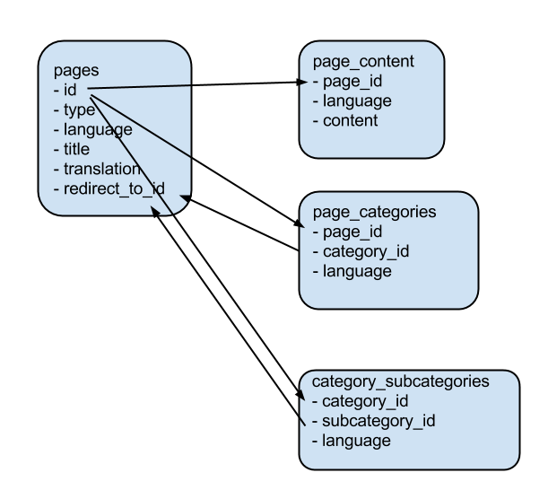

# Wiki Conversion

Convert the English and Chinese Wiki databases into single database with the mapping of pages between two languages.

## Preparation

1 Download the following Wiki tables

* category, categorylinks, langlinks, page, and redirect from from http://dumps.wikimedia.org/enwiki/latest/
* categorylinks, page, and redirect from from http://dumps.wikimedia.org/zhwiki/latest/

2 Create two local databases and import the downloaded tables respectively.

3 Create one output database

4 Copy database.yml.example to database.yml, and edit with your local database configs.

5 Run the following commands in command line:

> gem install bundler

> bundler install

> ./cmd convert

> ./cmd fetch

## Output tables explained

### pages table

The pages table includes both wiki page (e.g., http://en.wikipedia.org/wiki/Politics) and category page (e.g., http://en.wikipedia.org/wiki/Category:Politics), distinguished by the **type** field (0 for page, 1 for category). It also includes both English and Chinese pages, distinguished by the **language** field (0 for English, and 1 for Chinese).

* id: id is exactly the same with the id in the WikiMedia dump. Note that id is not unique. Same id could be used in the English and Chinese database to refer to different page. Always combine with the **language** field to avoid ambiguity.
 Always use the **language** field to avoid ambiguity.
* type: 0 for wiki page, 1 for category page
* langauge: 0 for English, 1 for Chinese
* title: Title of the page
* translation: Translation of the title. Using the translation can find the corresponding record of the translation.
* redirect_to_id: When set, it means the page is being redirected to the other page with id equals to **redirect_to_id**.

### page_categories

Stores the relations of pages and their categories. (e.g., http://en.wikipedia.org/wiki/Politics#catlinks)

* page_id
* category_id
* language

### category_subcategories

Stores the relations of categories and their subcategories. (e.g., http://en.wikipedia.org/wiki/Category:Politics#mw-subcategories)

* category_id
* subcategory_id
* language

### page_content

* page_id
* language
* content
